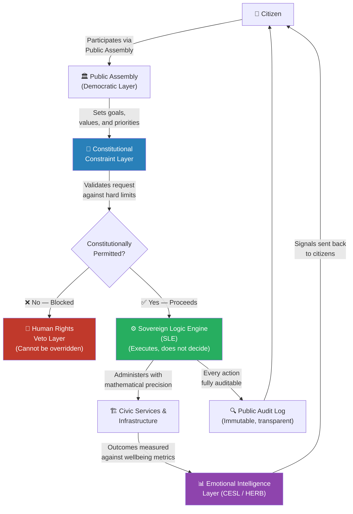
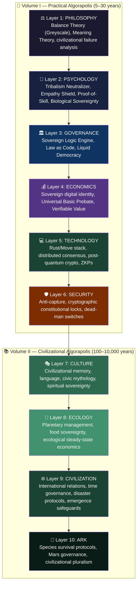
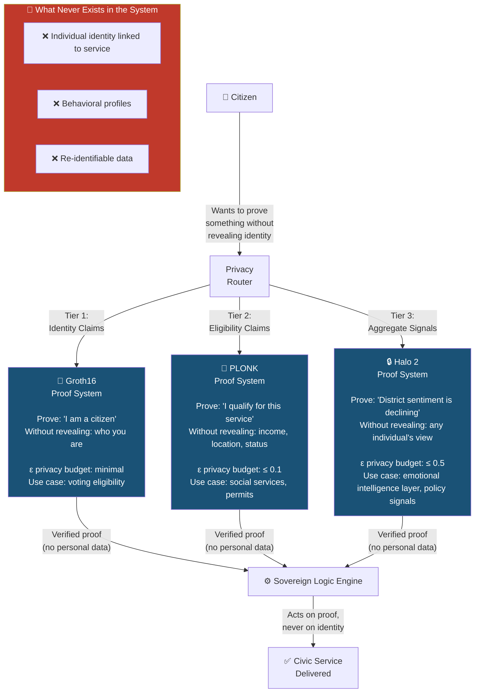
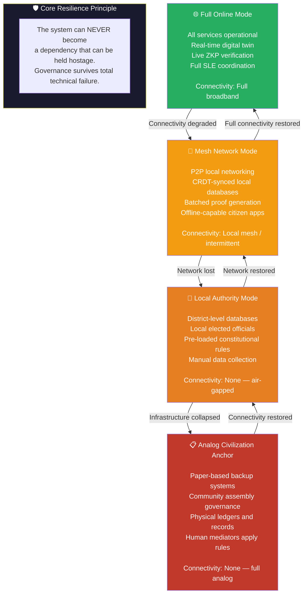

# 🗺️ Algorapolis — Visual Architecture

> These diagrams render natively on GitHub. They document the core architecture, governance flows, and transition model of the Algorapolis framework. All diagrams are generated using [Mermaid](https://mermaid.js.org/) and are maintained as living documentation.

---

## Table of Contents

- [1. The Governance Flow](#1-the-governance-flow)
- [2. The Sovereign Logic Engine (SLE) — Interaction Map](#2-the-sovereign-logic-engine-sle--interaction-map)
- [3. The Civilization Stack — 10 Layers](#3-the-civilization-stack--10-layers)
- [4. The Privacy Architecture — Three-Tier ZKP System](#4-the-privacy-architecture--three-tier-zkp-system)
- [5. The Transition Roadmap — Phase 0 to Phase 5](#5-the-transition-roadmap--phase-0-to-phase-5)
- [6. Offline Resilience — Graceful Degradation Model](#6-offline-resilience--graceful-degradation-model)
- [7. The Digital Twin — Data Flow Architecture](#7-the-digital-twin--data-flow-architecture)
- [8. Anti-Capture Architecture](#8-anti-capture-architecture)

---

## 1. The Governance Flow

How a citizen's voice becomes a governance decision — and how the system prevents that decision from being corrupted.

---

## 2. The Sovereign Logic Engine (SLE) — Interaction Map

What the SLE **can** and **cannot** do. This diagram defines the hard boundary between algorithmic administration and human authority.

```mermaid
flowchart LR
    subgraph HUMAN["🧑 Human Authority Domain\n(Cannot be delegated to SLE)"]
        H1["Setting societal values\nand priorities"]
        H2["Human rights decisions"]
        H3["Judicial rulings on\nmoral questions"]
        H4["Cultural & spiritual\nchoices"]
        H5["Emergency civic overrides"]
        H6["Constitutional amendments"]
    end

    subgraph SLE["⚙️ Sovereign Logic Engine\n(Executes within bounds)"]
        S1["Resource allocation\noptimization"]
        S2["Administrative\nscheduling"]
        S3["Infrastructure\nmonitoring"]
        S4["Regulatory\ncompliance checking"]
        S5["Budget execution\nper approved targets"]
        S6["Service delivery\nrouting"]
    end

    subgraph FORBIDDEN["🚫 Permanently Forbidden\n(Hard Constitutional Locks)"]
        F1["Individual\nbehavioral scoring"]
        F2["Predictive policing\nor sentencing"]
        F3["Bodily sovereignty\nviolations"]
        F4["Self-modifying\ngoals or objectives"]
        F5["Suppressing\nopposition or dissent"]
        F6["Overriding\nhuman override"]
    end

    HUMAN -->|"Mandates targets\nand constraints"| SLE
    SLE -->|"Reports outcomes\nfor democratic review"| HUMAN
    SLE -. "Permanently\nblocked from" .-> FORBIDDEN

    style FORBIDDEN fill:#c0392b,color:#fff
    style HUMAN fill:#2980b9,color:#fff
    style SLE fill:#27ae60,color:#fff
```

---

## 3. The Civilization Stack — 10 Layers

The full architecture from philosophical foundation to interplanetary governance.

---

## 4. The Privacy Architecture — Three-Tier ZKP System

How Algorapolis proves citizen eligibility without revealing citizen identity. Privacy is mathematical — not a policy promise.

---

## 5. The Transition Roadmap — Phase 0 to Phase 5

A grounded, reversible migration path from today's governance to Algorapolis. Every phase can be rolled back.

```mermaid
timeline
    title Algorapolis Transition — Civic Migration Path

    section Phase 0 (NOW — 2026)
        Open-Source Specification : Framework published and open for review
        Academic Review : Peer review and adversarial critique invited
        Community Formation : Researchers, engineers, civic technologists engaged

    section Phase 1 (2026 — 2027)
        Civic Reporting App : Citizens report infrastructure failures via USSD/SMS/web
        Transparent Procurement Portal : All government tenders published in real-time
        SLE Prototype : Narrow, bounded, auditable engine built and adversarially tested

    section Phase 2 (2027 — 2028)
        Digital Land Registry : Paper title deeds replaced with verifiable digital records
        Basic IoT Sensors : Environmental and infrastructure monitoring deployed
        Tanzania Pilot MOU : First district-level government agreement signed

    section Phase 3 (2028 — 2030)
        Live District Pilot : Real citizens, real services, real SLE execution with full rollback protocol
        Governance Sandbox : All new policies tested in simulation before deployment
        Digital Twin (District) : Real-time model of pilot region with live data feeds

    section Phase 4 (2030 — 2033)
        Municipal Coordination : SLE coordinating city-level infrastructure across departments
        Participatory Budgeting : Citizens allocate district budgets via liquid democracy interface
        Emotional Intelligence Layer : CESL and HERB monitoring civic wellbeing

    section Phase 5 (2033 — 2036)
        National Infrastructure Coordination : Full national digital twin and real-time coordination
        National SLE Deployment : Algorapolis operating at sovereign scale
        International Framework : Framework published for adoption by other nations
```

---

## 6. Offline Resilience — Graceful Degradation Model

Algorapolis is designed so that when technology fails, governance does not. The system degrades gracefully through four levels.

---

## 7. The Digital Twin — Data Flow Architecture

How the National Digital Twin collects, processes, and uses real-world data while maintaining mathematical privacy.

```mermaid
flowchart LR
    subgraph INPUTS["📡 Real-World Data Inputs"]
        I1["🛰️ Satellite Imagery\n(ESA Sentinel, NASA MODIS)"]
        I2["📱 Mobile Money Flows\n(M-Pesa, Tigo, Airtel)\nFully anonymized"]
        I3["🌡️ IoT Sensor Network\n(infrastructure, environment,\nwater, power grid)"]
        I4["📊 Official Statistics\n(census, health, education)"]
        I5["📣 Civic Reports\n(citizen-submitted via\nUSSD/SMS/web)"]
    end

    subgraph PROCESSING["⚙️ Privacy-Preserving Processing"]
        P1["Differential Privacy\nEngine\n(ε ≤ 0.5)"]
        P2["Aggregate Signal\nExtraction\n(no individual data)"]
        P3["Constitutional\nBound Checker"]
    end

    subgraph TWIN["🗺️ National Digital Twin"]
        T1["Infrastructure\nLayer"]
        T2["Economic\nLayer"]
        T3["Environmental\nLayer"]
        T4["Social &\nWellbeing Layer"]
    end

    subgraph OUTPUTS["🏛️ Governance Outputs"]
        O1["Governance\nSandbox\n(policy testing)"]
        O2["Predictive\nEarly Warning\n(infrastructure, health)"]
        O3["SLE Resource\nAllocation\n(optimization targets)"]
        O4["Public\nDashboard\n(citizen-facing)"]
    end

    INPUTS --> PROCESSING
    PROCESSING --> TWIN
    TWIN --> OUTPUTS

    style PROCESSING fill:#1a5276,color:#fff
    style TWIN fill:#1b4332,color:#fff
```

---

## 8. Anti-Capture Architecture

How Algorapolis prevents any individual, corporation, party, or institution from taking control of the system.

```mermaid
flowchart TD
    THREAT["⚠️ Capture Attempt\n(by any actor: political, corporate,\nmilitary, or algorithmic)"] --> LAYER1

    subgraph LAYER1["Layer 1: Constitutional Locks\n(Mathematical — cannot be repealed by majority)"]
        C1["Four Guardrails hard-coded\ninto SLE at verification level"]
        C2["Six Human-Reserved Domains\nwhere SLE is permanently excluded"]
        C3["Formal Lean 4 proofs\nverified by external researchers"]
    end

    LAYER1 -->|"If capture reaches\nlegislative level"| LAYER2

    subgraph LAYER2["Layer 2: Structural Anti-Corruption\n(Institutional — survives political shifts)"]
        S1["HERB (Human Experience Review Board)\nSortition-selected, not elected"]
        S2["Adversarial Audit Teams\n(paid to find flaws — permanently funded)"]
        S3["Transparency-by-default\n(every SLE action publicly logged)"]
    end

    LAYER2 -->|"If institutions\nare captured"| LAYER3

    subgraph LAYER3["Layer 3: Citizen Override\n(Distributed — cannot be turned off centrally)"]
        O1["Real-time liquid democracy\nveto mechanisms"]
        O2["Direct Civic Reporting\nchannels (bypass officials)"]
        O3["Dead-man switches\n(automatic dissolution of\ncaptured emergency powers)"]
    end

    LAYER3 -->|"If all else fails"| LAYER4

    subgraph LAYER4["Layer 4: Offline Resilience\n(Physical — survives infrastructure attacks)"]
        A1["Analog Civilization Anchors\n(paper-based governance backup)"]
        A2["Distributed data embassies\n(no single point of failure)"]
        A3["Open-source specification\n(can be re-instantiated from scratch)"]
    end

    CAPTURE_FAIL["✅ Capture Fails\nCivilization Continues"]
    LAYER4 --> CAPTURE_FAIL

    style THREAT fill:#c0392b,color:#fff
    style LAYER1 fill:#1a5276,color:#fff
    style LAYER2 fill:#1b4332,color:#fff
    style LAYER3 fill:#7b2d00,color:#fff
    style LAYER4 fill:#2d3436,color:#fff
    style CAPTURE_FAIL fill:#27ae60,color:#fff
```

---

## Contributing Diagrams

These diagrams are maintained as living documentation. If you identify inaccuracies, propose new diagrams, or want to contribute improved versions:

1. All diagrams are written in [Mermaid syntax](https://mermaid.js.org/syntax/flowchart.html) and render natively on GitHub.
2. Open a pull request with your proposed changes to `DIAGRAMS.md`.
3. Reference the specific specification section your diagram illustrates.

See [`CONTRIBUTING.md`](CONTRIBUTING.md) for full contribution guidelines.

---

  <em>Architecture is visible thinking. These diagrams make Algorapolis's structural logic impossible to misread.</em>

