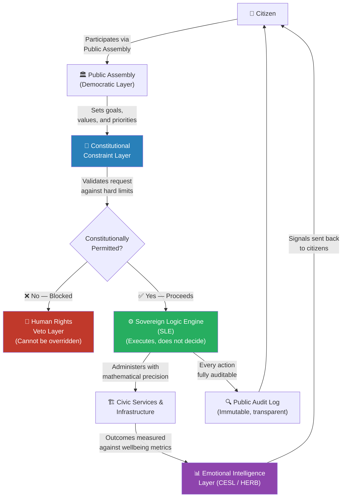
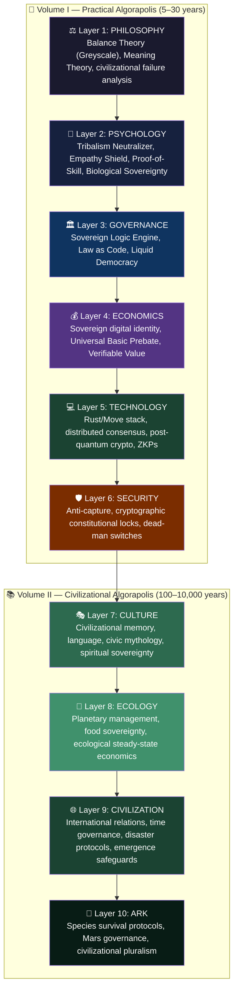
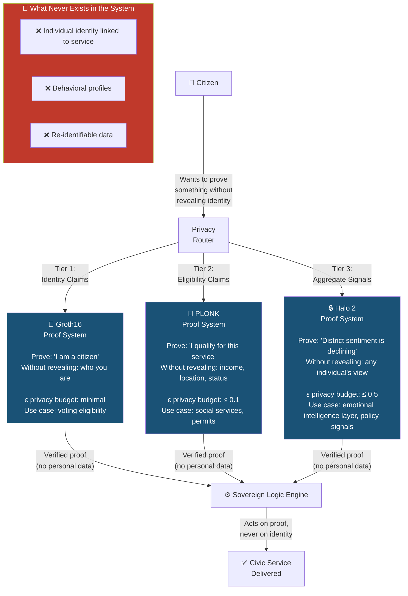
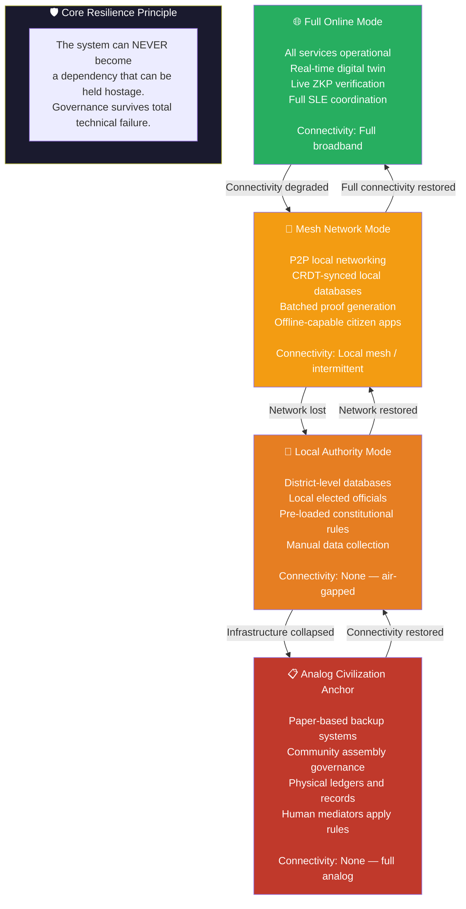
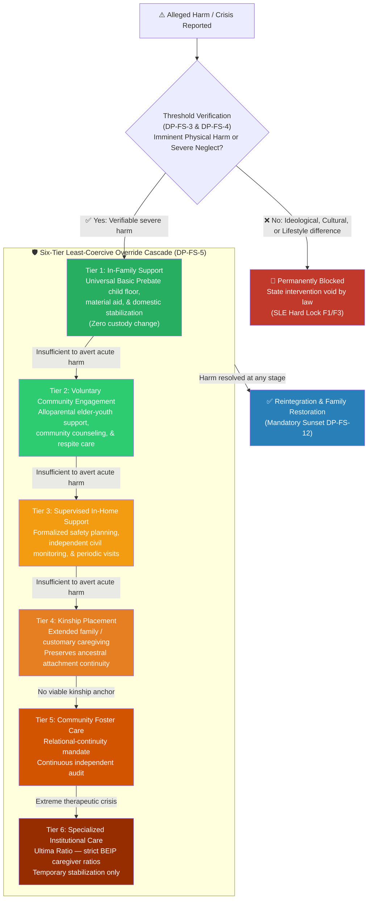
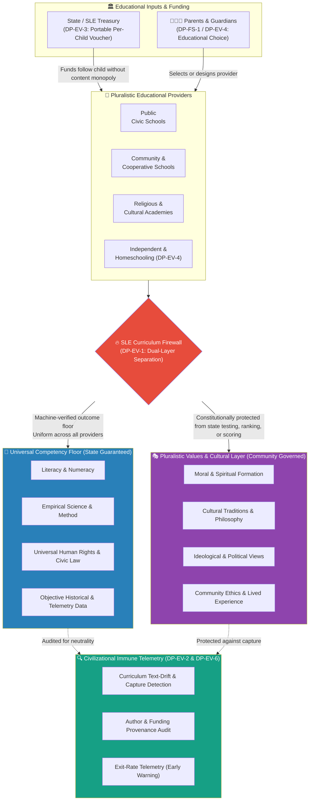
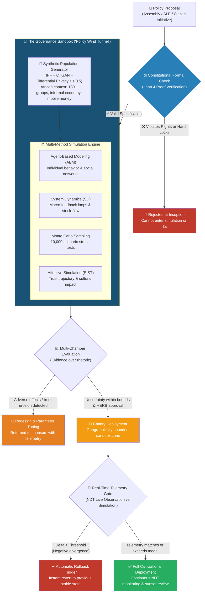
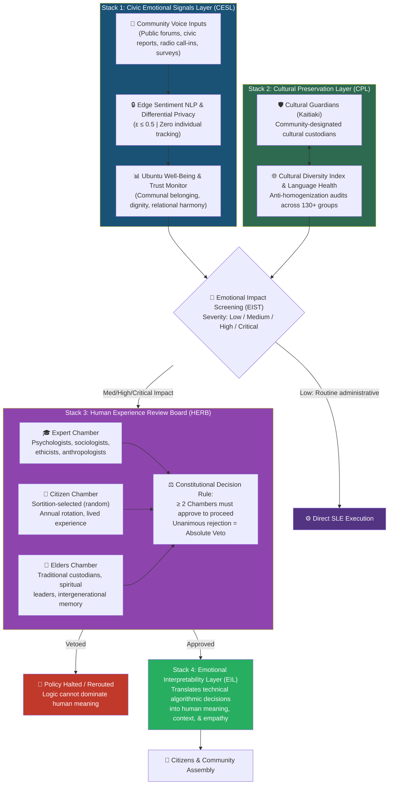
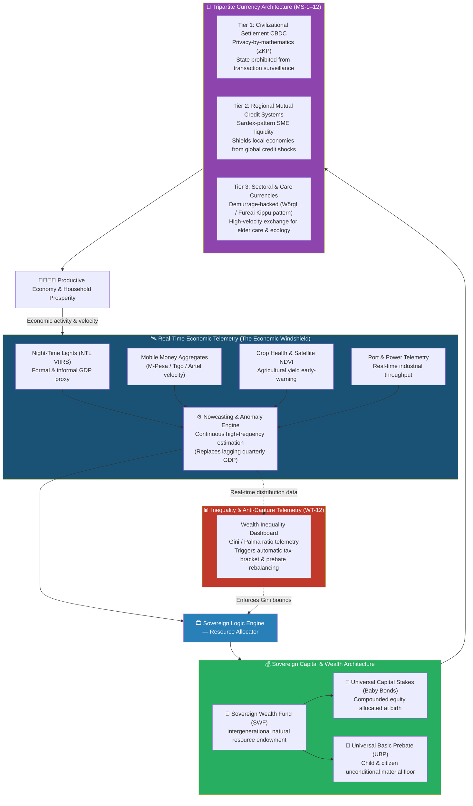
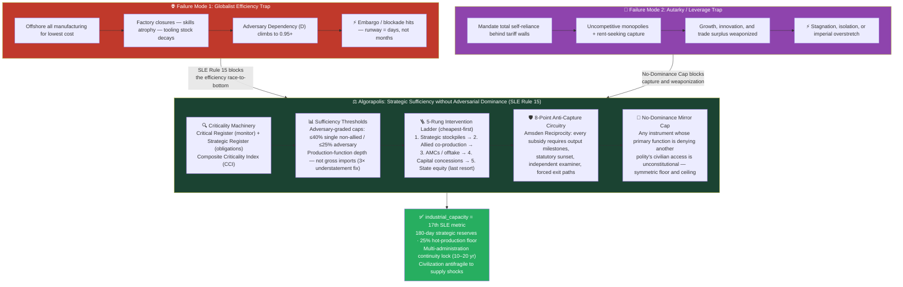

# 🗺️ Algorapolis — Visual Architecture

> These diagrams render natively on GitHub. They document the core architecture, governance flows, and transition model of the Algorapolis framework. All diagrams are generated using [Mermaid](https://mermaid.js.org/) and are maintained as living documentation.

---

## Table of Contents

- [1. The Governance Flow](#1-the-governance-flow)
- [2. The Sovereign Logic Engine (SLE) — Interaction Map](#2-the-sovereign-logic-engine-sle--interaction-map)
- [3. The Civilization Stack — 10 Layers](#3-the-civilization-stack--10-layers)
- [4. The Privacy Architecture — Three-Tier ZKP System](#4-the-privacy-architecture--three-tier-zkp-system)
- [5. The Transition Roadmap — Phase 0 to Phase 5](#5-the-transition-roadmap--phase-0-to-phase-5)
- [6. Offline Resilience — Graceful Degradation Model](#6-offline-resilience--graceful-degradation-model)
- [7. The Digital Twin — Data Flow Architecture](#7-the-digital-twin--data-flow-architecture)
- [8. Anti-Capture Architecture](#8-anti-capture-architecture)
- [9. Family Sovereignty — The Six-Tier Override Cascade](#9-family-sovereignty--the-six-tier-override-cascade)
- [10. Education & Values Transmission — The Curriculum Firewall](#10-education--values-transmission--the-curriculum-firewall)
- [11. The Governance Sandbox & Policy Simulation Lifecycle](#11-the-governance-sandbox--policy-simulation-lifecycle)
- [12. The Emotional Intelligence Architecture (CESL & HERB)](#12-the-emotional-intelligence-architecture-cesl--herb)
- [13. The Sovereign Economic Cycle & Monetary Telemetry](#13-the-sovereign-economic-cycle--monetary-telemetry)
- [14. The Industrial Sovereignty Two-Front Architecture](#14-the-industrial-sovereignty-two-front-architecture)

---

## 1. The Governance Flow

How a citizen's voice becomes a governance decision — and how the system prevents that decision from being corrupted.

```mermaid
flowchart TD
    A["🧑 Citizen"] -->|"Participates via\nPublic Assembly"| B["🏛️ Public Assembly\n(Democratic Layer)"]
    B -->|"Sets goals,\nvalues, and priorities"| C["📜 Constitutional\nConstraint Layer"]
    C -->|"Validates request\nagainst hard limits"| D{"Constitutionally\nPermitted?"}
    D -->|"❌ No — Blocked"| E["🛑 Human Rights\nVeto Layer\n(Cannot be overridden)"]
    D -->|"✅ Yes — Proceeds"| F["⚙️ Sovereign Logic Engine\n(SLE)\n(Executes, does not decide)"]
    F -->|"Administers with\nmathematical precision"| G["🏗️ Civic Services &\nInfrastructure"]
    G -->|"Outcomes measured\nagainst wellbeing metrics"| H["📊 Emotional Intelligence\nLayer (CESL / HERB)"]
    H -->|"Signals sent back\nto citizens"| A
    F -->|"Every action\nfully auditable"| I["🔍 Public Audit Log\n(Immutable, transparent)"]
    I --> A

    style E fill:#c0392b,color:#fff
    style C fill:#2980b9,color:#fff
    style F fill:#27ae60,color:#fff
    style H fill:#8e44ad,color:#fff
```

---

## 2. The Sovereign Logic Engine (SLE) — Interaction Map

What the SLE **can** and **cannot** do. This diagram defines the hard boundary between algorithmic administration and human authority.

```mermaid
flowchart LR
    subgraph HUMAN["🧑 Human Authority Domain\n(Cannot be delegated to SLE)"]
        H1["Setting societal values\nand priorities"]
        H2["Human rights decisions"]
        H3["Judicial rulings on\nmoral questions"]
        H4["Cultural & spiritual\nchoices"]
        H5["Emergency civic overrides"]
        H6["Constitutional amendments"]
    end

    subgraph SLE["⚙️ Sovereign Logic Engine\n(Executes within bounds)"]
        S1["Resource allocation\noptimization"]
        S2["Administrative\nscheduling"]
        S3["Infrastructure\nmonitoring"]
        S4["Regulatory\ncompliance checking"]
        S5["Budget execution\nper approved targets"]
        S6["Service delivery\nrouting"]
    end

    subgraph FORBIDDEN["🚫 Permanently Forbidden\n(Hard Constitutional Locks)"]
        F1["Individual\nbehavioral scoring"]
        F2["Predictive policing\nor sentencing"]
        F3["Bodily sovereignty\nviolations"]
        F4["Self-modifying\ngoals or objectives"]
        F5["Suppressing\nopposition or dissent"]
        F6["Overriding\nhuman override"]
    end

    HUMAN -->|"Mandates targets\nand constraints"| SLE
    SLE -->|"Reports outcomes\nfor democratic review"| HUMAN
    SLE -. "Permanently\nblocked from" .-> FORBIDDEN

    style FORBIDDEN fill:#c0392b,color:#fff
    style HUMAN fill:#2980b9,color:#fff
    style SLE fill:#27ae60,color:#fff
```

---

## 3. The Civilization Stack — 10 Layers

The full architecture from philosophical foundation to interplanetary governance.

```mermaid
graph TB
    subgraph VOLUME2["📚 Volume II — Civilizational Algorapolis (100–10,000 years)"]
        L10["🚀 Layer 10: ARK\nSpecies survival protocols, Mars governance, civilizational pluralism"]
        L9["🌐 Layer 9: CIVILIZATION\nInternational relations, time governance, disaster protocols, emergence safeguards"]
        L8["🌿 Layer 8: ECOLOGY\nPlanetary management, food sovereignty, ecological steady-state economics"]
        L7["🎭 Layer 7: CULTURE\nCivilizational memory, language, civic mythology, spiritual sovereignty"]
    end

    subgraph VOLUME1["📗 Volume I — Practical Algorapolis (5–30 years)"]
        L6["🛡️ Layer 6: SECURITY\nAnti-capture, cryptographic constitutional locks, dead-man switches"]
        L5["💻 Layer 5: TECHNOLOGY\nRust/Move stack, distributed consensus, post-quantum crypto, ZKPs"]
        L4["💰 Layer 4: ECONOMICS\nSovereign digital identity, Universal Basic Prebate, Verifiable Value"]
        L3["🏛️ Layer 3: GOVERNANCE\nSovereign Logic Engine, Law as Code, Liquid Democracy"]
        L2["🧠 Layer 2: PSYCHOLOGY\nTribalism Neutralizer, Empathy Shield, Proof-of-Skill, Biological Sovereignty"]
        L1["⚖️ Layer 1: PHILOSOPHY\nBalance Theory (Greyscale), Meaning Theory, civilizational failure analysis"]
    end

    L1 --> L2 --> L3 --> L4 --> L5 --> L6
    L6 --> L7 --> L8 --> L9 --> L10

    style L1 fill:#1a1a2e,color:#fff
    style L2 fill:#16213e,color:#fff
    style L3 fill:#0f3460,color:#fff
    style L4 fill:#533483,color:#fff
    style L5 fill:#1b4332,color:#fff
    style L6 fill:#7b2d00,color:#fff
    style L7 fill:#2d6a4f,color:#fff
    style L8 fill:#40916c,color:#fff
    style L9 fill:#1b4332,color:#fff
    style L10 fill:#081c15,color:#fff
```

---

## 4. The Privacy Architecture — Three-Tier ZKP System

How Algorapolis proves citizen eligibility without revealing citizen identity. Privacy is mathematical — not a policy promise.

```mermaid
flowchart TD
    Citizen["🧑 Citizen"] -->|"Wants to prove\nsomething without\nrevealing identity"| Router["Privacy\nRouter"]

    Router -->|"Tier 1:\nIdentity Claims"| T1["🔐 Groth16\nProof System\n\nProve: 'I am a citizen'\nWithout revealing: who you are\n\nε privacy budget: minimal\nUse case: voting eligibility"]

    Router -->|"Tier 2:\nEligibility Claims"| T2["🔏 PLONK\nProof System\n\nProve: 'I qualify for this service'\nWithout revealing: income, location, status\n\nε privacy budget: ≤ 0.1\nUse case: social services, permits"]

    Router -->|"Tier 3:\nAggregate Signals"| T3["🔒 Halo 2\nProof System\n\nProve: 'District sentiment is declining'\nWithout revealing: any individual's view\n\nε privacy budget: ≤ 0.5\nUse case: emotional intelligence layer, policy signals"]

    T1 & T2 & T3 -->|"Verified proof\n(no personal data)"| SLE["⚙️ Sovereign Logic Engine"]
    SLE -->|"Acts on proof,\nnever on identity"| Service["✅ Civic Service\nDelivered"]

    subgraph NEVER["🚫 What Never Exists in the System"]
        N1["❌ Individual identity linked to service"]
        N2["❌ Behavioral profiles"]
        N3["❌ Re-identifiable data"]
    end

    style NEVER fill:#c0392b,color:#fff
    style T1 fill:#1a5276,color:#fff
    style T2 fill:#1a5276,color:#fff
    style T3 fill:#1a5276,color:#fff
```

---

## 5. The Transition Roadmap — Phase 0 to Phase 5

A grounded, reversible migration path from today's governance to Algorapolis. Every phase can be rolled back.

```mermaid
timeline
    title Algorapolis Transition — Civic Migration Path

    section Phase 0 (NOW — 2026)
        Open-Source Specification : Framework published and open for review
        Academic Review : Peer review and adversarial critique invited
        Community Formation : Researchers, engineers, civic technologists engaged

    section Phase 1 (2026 — 2027)
        Civic Reporting App : Citizens report infrastructure failures via USSD/SMS/web
        Transparent Procurement Portal : All government tenders published in real-time
        SLE Prototype : Narrow, bounded, auditable engine built and adversarially tested

    section Phase 2 (2027 — 2028)
        Digital Land Registry : Paper title deeds replaced with verifiable digital records
        Basic IoT Sensors : Environmental and infrastructure monitoring deployed
        Tanzania Pilot MOU : First district-level government agreement signed

    section Phase 3 (2028 — 2030)
        Live District Pilot : Real citizens, real services, real SLE execution with full rollback protocol
        Governance Sandbox : All new policies tested in simulation before deployment
        Digital Twin (District) : Real-time model of pilot region with live data feeds

    section Phase 4 (2030 — 2033)
        Municipal Coordination : SLE coordinating city-level infrastructure across departments
        Participatory Budgeting : Citizens allocate district budgets via liquid democracy interface
        Emotional Intelligence Layer : CESL and HERB monitoring civic wellbeing

    section Phase 5 (2033 — 2036)
        National Infrastructure Coordination : Full national digital twin and real-time coordination
        National SLE Deployment : Algorapolis operating at sovereign scale
        International Framework : Framework published for adoption by other nations
```

---

## 6. Offline Resilience — Graceful Degradation Model

Algorapolis is designed so that when technology fails, governance does not. The system degrades gracefully through four levels.

```mermaid
flowchart TD
    FULL["🌐 Full Online Mode\n\nAll services operational\nReal-time digital twin\nLive ZKP verification\nFull SLE coordination\n\nConnectivity: Full broadband"] -->|"Connectivity degraded"| MESH

    MESH["📡 Mesh Network Mode\n\nP2P local networking\nCRDT-synced local databases\nBatched proof generation\nOffline-capable citizen apps\n\nConnectivity: Local mesh / intermittent"] -->|"Network lost"| LOCAL

    LOCAL["💾 Local Authority Mode\n\nDistrict-level databases\nLocal elected officials\nPre-loaded constitutional rules\nManual data collection\n\nConnectivity: None — air-gapped"] -->|"Infrastructure collapsed"| ANALOG

    ANALOG["📋 Analog Civilization Anchor\n\nPaper-based backup systems\nCommunity assembly governance\nPhysical ledgers and records\nHuman mediators apply rules\n\nConnectivity: None — full analog"]

    ANALOG -->|"Connectivity restored"| LOCAL
    LOCAL -->|"Network restored"| MESH
    MESH -->|"Full connectivity restored"| FULL

    subgraph PRINCIPLE["🛡️ Core Resilience Principle"]
        P["The system can NEVER become\na dependency that can be held hostage.\nGovernance survives total technical failure."]
    end

    style FULL fill:#27ae60,color:#fff
    style MESH fill:#f39c12,color:#fff
    style LOCAL fill:#e67e22,color:#fff
    style ANALOG fill:#c0392b,color:#fff
    style PRINCIPLE fill:#1a1a2e,color:#fff
```

---

## 7. The Digital Twin — Data Flow Architecture

How the National Digital Twin collects, processes, and uses real-world data while maintaining mathematical privacy.

```mermaid
flowchart LR
    subgraph INPUTS["📡 Real-World Data Inputs"]
        I1["🛰️ Satellite Imagery\n(ESA Sentinel, NASA MODIS)"]
        I2["📱 Mobile Money Flows\n(M-Pesa, Tigo, Airtel)\nFully anonymized"]
        I3["🌡️ IoT Sensor Network\n(infrastructure, environment,\nwater, power grid)"]
        I4["📊 Official Statistics\n(census, health, education)"]
        I5["📣 Civic Reports\n(citizen-submitted via\nUSSD/SMS/web)"]
    end

    subgraph PROCESSING["⚙️ Privacy-Preserving Processing"]
        P1["Differential Privacy\nEngine\n(ε ≤ 0.5)"]
        P2["Aggregate Signal\nExtraction\n(no individual data)"]
        P3["Constitutional\nBound Checker"]
    end

    subgraph TWIN["🗺️ National Digital Twin"]
        T1["Infrastructure\nLayer"]
        T2["Economic\nLayer"]
        T3["Environmental\nLayer"]
        T4["Social &\nWellbeing Layer"]
    end

    subgraph OUTPUTS["🏛️ Governance Outputs"]
        O1["Governance\nSandbox\n(policy testing)"]
        O2["Predictive\nEarly Warning\n(infrastructure, health)"]
        O3["SLE Resource\nAllocation\n(optimization targets)"]
        O4["Public\nDashboard\n(citizen-facing)"]
    end

    INPUTS --> PROCESSING
    PROCESSING --> TWIN
    TWIN --> OUTPUTS

    style PROCESSING fill:#1a5276,color:#fff
    style TWIN fill:#1b4332,color:#fff
```

---

## 8. Anti-Capture Architecture

How Algorapolis prevents any individual, corporation, party, or institution from taking control of the system.

```mermaid
flowchart TD
    THREAT["⚠️ Capture Attempt\n(by any actor: political, corporate,\nmilitary, or algorithmic)"] --> LAYER1

    subgraph LAYER1["Layer 1: Constitutional Locks\n(Mathematical — cannot be repealed by majority)"]
        C1["Four Guardrails hard-coded\ninto SLE at verification level"]
        C2["Six Human-Reserved Domains\nwhere SLE is permanently excluded"]
        C3["Formal Lean 4 proofs\nverified by external researchers"]
    end

    LAYER1 -->|"If capture reaches\nlegislative level"| LAYER2

    subgraph LAYER2["Layer 2: Structural Anti-Corruption\n(Institutional — survives political shifts)"]
        S1["HERB (Human Experience Review Board)\nSortition-selected, not elected"]
        S2["Adversarial Audit Teams\n(paid to find flaws — permanently funded)"]
        S3["Transparency-by-default\n(every SLE action publicly logged)"]
    end

    LAYER2 -->|"If institutions\nare captured"| LAYER3

    subgraph LAYER3["Layer 3: Citizen Override\n(Distributed — cannot be turned off centrally)"]
        O1["Real-time liquid democracy\nveto mechanisms"]
        O2["Direct Civic Reporting\nchannels (bypass officials)"]
        O3["Dead-man switches\n(automatic dissolution of\ncaptured emergency powers)"]
    end

    LAYER3 -->|"If all else fails"| LAYER4

    subgraph LAYER4["Layer 4: Offline Resilience\n(Physical — survives infrastructure attacks)"]
        A1["Analog Civilization Anchors\n(paper-based governance backup)"]
        A2["Distributed data embassies\n(no single point of failure)"]
        A3["Open-source specification\n(can be re-instantiated from scratch)"]
    end

    CAPTURE_FAIL["✅ Capture Fails\nCivilization Continues"]
    LAYER4 --> CAPTURE_FAIL

    style THREAT fill:#c0392b,color:#fff
    style LAYER1 fill:#1a5276,color:#fff
    style LAYER2 fill:#1b4332,color:#fff
    style LAYER3 fill:#7b2d00,color:#fff
    style LAYER4 fill:#2d3436,color:#fff
    style CAPTURE_FAIL fill:#27ae60,color:#fff
```

---

## 9. Family Sovereignty — The Six-Tier Override Cascade

How Algorapolis protects the family unit from state overreach while preventing child abuse. Intervention proceeds strictly through least-coercive means, with ideological and moral values permanently excluded from intervention criteria (`DP-FS-1`–`12`, SLE Mandate 14).

```mermaid
flowchart TD
    HarmReport["⚠️ Alleged Harm / Crisis Reported"] --> Gate{"Threshold Verification\n(DP-FS-3 & DP-FS-4)\nImminent Physical Harm or Severe Neglect?"}
    
    Gate -->|"❌ No: Ideological, Cultural, or Lifestyle difference"| Blocked["🛑 Permanently Blocked\nState intervention void by law\n(SLE Hard Lock F1/F3)"]
    Gate -->|"✅ Yes: Verifiable severe harm"| T1

    subgraph CASCADE["🛡️ Six-Tier Least-Coercive Override Cascade (DP-FS-5)"]
        T1["Tier 1: In-Family Support\nUniversal Basic Prebate child floor,\nmaterial aid, & domestic stabilization\n(Zero custody change)"]
        T2["Tier 2: Voluntary Community Engagement\nAlloparental elder-youth support,\ncommunity counseling, & respite care"]
        T3["Tier 3: Supervised In-Home Support\nFormalized safety planning,\nindependent civil monitoring, & periodic visits"]
        T4["Tier 4: Kinship Placement\nExtended family / customary caregiving\nPreserves ancestral attachment continuity"]
        T5["Tier 5: Community Foster Care\nRelational-continuity mandate\nContinuous independent audit"]
        T6["Tier 6: Specialized Institutional Care\nUltima Ratio — strict BEIP caregiver ratios\nTemporary stabilization only"]

        T1 -->|"Insufficient to avert acute harm"| T2
        T2 -->|"Insufficient to avert acute harm"| T3
        T3 -->|"Insufficient to avert acute harm"| T4
        T4 -->|"No viable kinship anchor"| T5
        T5 -->|"Extreme therapeutic crisis"| T6
    end

    CASCADE -->|"Harm resolved at any stage"| Reintegration["✅ Reintegration & Family Restoration\n(Mandatory Sunset DP-FS-12)"]

    style Blocked fill:#c0392b,color:#fff
    style T1 fill:#27ae60,color:#fff
    style T2 fill:#2ecc71,color:#fff
    style T3 fill:#f39c12,color:#fff
    style T4 fill:#e67e22,color:#fff
    style T5 fill:#d35400,color:#fff
    style T6 fill:#962d00,color:#fff
    style Reintegration fill:#2980b9,color:#fff
```

---

## 10. Education & Values Transmission — The Curriculum Firewall

How Algorapolis decouples universal competency standards from cultural/moral indoctrination (`DP-EV-1`–`6`). The Sovereign Logic Engine enforces the objective floor while protecting pluralistic community values and parental choice.

```mermaid
flowchart TD
    subgraph INPUT["🏛️ Educational Inputs & Funding"]
        Gov["State / SLE Treasury\n(DP-EV-3: Portable Per-Child Voucher)"]
        Parent["👨‍👩‍👧 Parents & Guardians\n(DP-FS-1 / DP-EV-4: Educational Choice)"]
    end

    Gov -->|"Funds follow child without content monopoly"| Providers

    subgraph Providers["🏫 Pluralistic Educational Providers"]
        P1["Public\nCivic Schools"]
        P2["Community &\nCooperative Schools"]
        P3["Religious &\nCultural Academies"]
        P4["Independent &\nHomeschooling (DP-EV-4)"]
    end

    Parent -->|"Selects or designs provider"| Providers

    Providers --> Firewall{"🔥 SLE Curriculum Firewall\n(DP-EV-1: Dual-Layer Separation)"}

    subgraph FLOOR["📘 Universal Competency Floor (State Guaranteed)"]
        F1["Literacy & Numeracy"]
        F2["Empirical Science & Method"]
        F3["Universal Human Rights & Civic Law"]
        F4["Objective Historical & Telemetry Data"]
    end

    subgraph VALUES["🎭 Pluralistic Values & Cultural Layer (Community Governed)"]
        V1["Moral & Spiritual Formation"]
        V2["Cultural Traditions & Philosophy"]
        V3["Ideological & Political Views"]
        V4["Community Ethics & Lived Experience"]
    end

    Firewall -->|"Machine-verified outcome floor\nUniform across all providers"| FLOOR
    Firewall -->|"Constitutionally protected from state testing, ranking, or scoring"| VALUES

    subgraph TELEMETRY["🔍 Civilizational Immune Telemetry (DP-EV-2 & DP-EV-6)"]
        M1["Curriculum Text-Drift & Capture Detection"]
        M2["Author & Funding Provenance Audit"]
        M3["Exit-Rate Telemetry (Early Warning)"]
    end

    FLOOR -. "Audited for neutrality" .-> TELEMETRY
    VALUES -. "Protected against capture" .-> TELEMETRY

    style Firewall fill:#e74c3c,color:#fff
    style FLOOR fill:#2980b9,color:#fff
    style VALUES fill:#8e44ad,color:#fff
    style TELEMETRY fill:#16a085,color:#fff
```

---

## 11. The Governance Sandbox & Policy Simulation Lifecycle

How Algorapolis subjects policy proposals to experimental testing before deployment. No policy affects real citizens until it has passed through the synthetic population "wind tunnel," formal constitutional verification, and multi-chamber review.

```mermaid
flowchart TD
    Prop["📜 Policy Proposal\n(Assembly / SLE / Citizen Initiative)"] --> Formal{"⚖️ Constitutional Formal Check\n(Lean 4 Proof Verification)"}
    
    Formal -->|"❌ Violates Rights or Hard Locks"| Veto["🛑 Rejected at Inception\nCannot enter simulation or law"]
    Formal -->|"✅ Valid Specification"| SandEngine

    subgraph SandEngine["🧪 The Governance Sandbox ('Policy Wind Tunnel')"]
        SynthPop["👥 Synthetic Population Generator\n(IPF + CTGAN + Differential Privacy ε ≤ 0.5)\nAfrican context: 130+ groups, informal economy, mobile money"]
        
        subgraph MultiSim["⚙️ Multi-Method Simulation Engine"]
            ABM["Agent-Based Modeling (ABM)\nIndividual behavior & social networks"]
            SD["System Dynamics (SD)\nMacro feedback loops & stock-flow"]
            MC["Monte Carlo Sampling\n10,000 scenario stress-tests"]
            Affect["Affective Simulation (EIST)\nTrust trajectory & cultural impact"]
        end
        
        SynthPop --> MultiSim
    end

    MultiSim --> Eval{"📊 Multi-Chamber Evaluation\n(Evidence over rhetoric)"}

    Eval -->|"Adverse effects / trust erosion detected"| Redesign["🔄 Redesign & Parameter Tuning\nReturned to sponsors with telemetry"]
    Eval -->|"Uncertainty within bounds & HERB approval"| Canary["🐥 Canary Deployment\nGeographically bounded sandbox zone"]

    Canary --> TelemetryGate{"📡 Real-Time Telemetry Gate\n(NDT Live Observation vs Simulation)"}
    TelemetryGate -->|"Delta > Threshold\n(Negative divergence)"| Rollback["⏪ Automatic Rollback Trigger\nInstant revert to previous stable state"]
    TelemetryGate -->|"Telemetry matches or exceeds model"| Live["✅ Full Civilizational Deployment\nContinuous NDT monitoring & sunset review"]

    style Veto fill:#c0392b,color:#fff
    style Formal fill:#2980b9,color:#fff
    style SandEngine fill:#1a5276,color:#fff
    style Redesign fill:#e67e22,color:#fff
    style Canary fill:#f39c12,color:#fff
    style Rollback fill:#c0392b,color:#fff
    style Live fill:#27ae60,color:#fff
```

---

## 12. The Emotional Intelligence Architecture (CESL & HERB)

How Algorapolis ensures that computational governance remains emotionally and culturally grounded. Collective sentiment is captured with mathematical privacy, evaluated by sortition-selected citizens, and feeds qualitative course corrections without individual profiling.

```mermaid
flowchart TD
    subgraph STACK1["Stack 1: Civic Emotional Signals Layer (CESL)"]
        Inputs["📡 Community Voice Inputs\n(Public forums, civic reports, radio call-ins, surveys)"]
        Edge["🔒 Edge Sentiment NLP & Differential Privacy\n(ε ≤ 0.5 | Zero individual tracking)"]
        Agg["📊 Ubuntu Well-Being & Trust Monitor\n(Communal belonging, dignity, relational harmony)"]
        Inputs --> Edge --> Agg
    end

    subgraph STACK2["Stack 2: Cultural Preservation Layer (CPL)"]
        Guardians["🛡️ Cultural Guardians (Kaitiaki)\nCommunity-designated cultural custodians"]
        DiversityIndex["🌐 Cultural Diversity Index & Language Health\nAnti-homogenization audits across 130+ groups"]
        Guardians <--> DiversityIndex
    end

    Agg & DiversityIndex --> Screener{"🧭 Emotional Impact Screening (EIST)\nSeverity: Low / Medium / High / Critical"}

    Screener -->|"Low: Routine administrative"| AutoProc["⚙️ Direct SLE Execution"]
    Screener -->|"Med/High/Critical Impact"| HERB

    subgraph HERB["Stack 3: Human Experience Review Board (HERB)"]
        C1["🎓 Expert Chamber\nPsychologists, sociologists,\nethicists, anthropologists"]
        C2["🧑 Citizen Chamber\nSortition-selected (random)\nAnnual rotation, lived experience"]
        C3["👴 Elders Chamber\nTraditional custodians, spiritual\nleaders, intergenerational memory"]
        
        Rule["⚖️ Constitutional Decision Rule:\n≥ 2 Chambers must approve to proceed\nUnanimous rejection = Absolute Veto"]
        
        C1 & C2 & C3 --> Rule
    end

    HERB -->|"Vetoed"| Blocked["🛑 Policy Halted / Rerouted\nLogic cannot dominate human meaning"]
    HERB -->|"Approved"| EIL["Stack 4: Emotional Interpretability Layer (EIL)\nTranslates technical algorithmic decisions\ninto human meaning, context, & empathy"]
    
    EIL --> Public["🧑 Citizens & Community Assembly"]

    style STACK1 fill:#1a5276,color:#fff
    style STACK2 fill:#2d6a4f,color:#fff
    style HERB fill:#8e44ad,color:#fff
    style Blocked fill:#c0392b,color:#fff
    style EIL fill:#27ae60,color:#fff
    style AutoProc fill:#533483,color:#fff
```

---

## 13. The Sovereign Economic Cycle & Monetary Telemetry

How real-time economic telemetry, sovereign capital endowments, and non-surveillance multi-tier currencies unite to provide unconditional material floors, prevent wealth hyper-concentration, and replace lagging retrospective metrics (quarterly GDP).

```mermaid
flowchart TD
    subgraph TELEMETRY["🛰️ Real-Time Economic Telemetry (The Economic Windshield)"]
        T1["Night-Time Lights (NTL VIIRS)\nFormal & informal GDP proxy"]
        T2["Mobile Money Aggregates\n(M-Pesa / Tigo / Airtel velocity)"]
        T3["Crop Health & Satellite NDVI\nAgricultural yield early-warning"]
        T4["Port & Power Telemetry\nReal-time industrial throughput"]
        
        Nowcast["⚙️ Nowcasting & Anomaly Engine\nContinuous high-frequency estimation\n(Replaces lagging quarterly GDP)"]
        
        T1 & T2 & T3 & T4 --> Nowcast
    end

    Nowcast --> SLE_Econ["🏛️ Sovereign Logic Engine — Resource Allocator"]

    subgraph WEALTH["💰 Sovereign Capital & Wealth Architecture"]
        SWF["🏦 Sovereign Wealth Fund (SWF)\nIntergenerational natural resource endowment"]
        Stakes["🌱 Universal Capital Stakes (Baby Bonds)\nCompounded equity allocated at birth"]
        Prebate["🍞 Universal Basic Prebate (UBP)\nChild & citizen unconditional material floor"]
        
        SWF --> Stakes & Prebate
    end

    SLE_Econ --> WEALTH

    subgraph CURRENCY["💱 Tripartite Currency Architecture (MS-1–12)"]
        C1["Tier 1: Civilizational Settlement CBDC\nPrivacy-by-mathematics (ZKP)\nState prohibited from transaction surveillance"]
        C2["Tier 2: Regional Mutual Credit Systems\nSardex-pattern SME liquidity\nShields local economies from global credit shocks"]
        C3["Tier 3: Sectoral & Care Currencies\nDemurrage-backed (Wörgl / Fureai Kippu pattern)\nHigh-velocity exchange for elder care & ecology"]
    end

    WEALTH --> CURRENCY
    CURRENCY --> Citizens["👨‍👩‍👧‍👦 Productive Economy & Household Prosperity"]
    Citizens -->|"Economic activity & velocity"| TELEMETRY

    subgraph AUDIT["📊 Inequality & Anti-Capture Telemetry (WT-12)"]
        Dashboard["Wealth Inequality Dashboard\nGini / Palma ratio telemetry\nTriggers automatic tax-bracket & prebate rebalancing"]
    end

    Nowcast -. "Real-time distribution data" .-> Dashboard
    Dashboard -. "Enforces Gini bounds" .-> SLE_Econ

    style TELEMETRY fill:#1a5276,color:#fff
    style WEALTH fill:#27ae60,color:#fff
    style CURRENCY fill:#8e44ad,color:#fff
    style AUDIT fill:#c0392b,color:#fff
    style SLE_Econ fill:#2980b9,color:#fff
```

---

## 14. The Industrial Sovereignty Two-Front Architecture

How Algorapolis navigates the two fatal industrial policy traps — the Globalist Efficiency Trap and the Autarky/Leverage Trap — through a constitutionally anchored doctrine of Strategic Sufficiency without Adversarial Dominance (`DP-PC-1`–`12`, `DP-ESG-1`–`7`, SLE Mandate 15).

```mermaid
flowchart TD
    subgraph TRAP1["🌐 Failure Mode 1: Globalist Efficiency Trap"]
        G1["Offshore all manufacturing for lowest cost"]
        G2["Factory closures — skills atrophy — tooling stock decays"]
        G3["Adversary Dependency (D) climbs to 0.95+"]
        G4["⚡ Embargo / blockade hits — runway = days, not months"]
        G1 --> G2 --> G3 --> G4
    end

    subgraph TRAP2["🏰 Failure Mode 2: Autarky / Leverage Trap"]
        A1["Mandate total self-reliance behind tariff walls"]
        A2["Uncompetitive monopolies + rent-seeking capture"]
        A3["Growth, innovation, and trade surplus weaponized"]
        A4["⚡ Stagnation, isolation, or imperial overstretch"]
        A1 --> A2 --> A3 --> A4
    end

    subgraph DOCTRINE["⚖️ Algorapolis: Strategic Sufficiency without Adversarial Dominance (SLE Rule 15)"]
        D1["🔍 Criticality Machinery\nCritical Register (monitor) + Strategic Register (obligations)\nComposite Criticality Index (CCI)"]
        D2["📊 Sufficiency Thresholds\nAdversary-graded caps: ≤40% single non-allied / ≤25% adversary\nProduction-function depth — not gross imports (3× understatement fix)"]
        D3["🪜 5-Rung Intervention Ladder (cheapest-first)\n1. Strategic stockpiles → 2. Allied co-production →\n3. AMCs / offtake → 4. Capital concessions → 5. State equity (last resort)"]
        D4["🛡️ 8-Point Anti-Capture Circuitry\nAmsden Reciprocity: every subsidy requires output milestones,\nstatutory sunset, independent examiner, forced exit paths"]
        D5["🚫 No-Dominance Mirror Cap\nAny instrument whose primary function is denying another\npolity's civilian access is unconstitutional — symmetric floor and ceiling"]

        D1 --> D2 --> D3 --> D4 --> D5
    end

    TRAP1 --> |"SLE Rule 15 blocks\nthe efficiency race-to-bottom"| DOCTRINE
    TRAP2 --> |"No-Dominance Cap blocks\ncapture and weaponization"| DOCTRINE

    DOCTRINE --> OUTCOME["✅ industrial_capacity = 17th SLE metric\n180-day strategic reserves · 25% hot-production floor\nMulti-administration continuity lock (10–20 yr)\nCivilization antifragile to supply shocks"]

    style TRAP1 fill:#c0392b,color:#fff
    style TRAP2 fill:#8e44ad,color:#fff
    style DOCTRINE fill:#1b4332,color:#fff
    style OUTCOME fill:#27ae60,color:#fff
```

---

These diagrams are maintained as living documentation. If you identify inaccuracies, propose new diagrams, or want to contribute improved versions:

1. All diagrams are written in [Mermaid syntax](https://mermaid.js.org/syntax/flowchart.html) and render natively on GitHub.
2. Open a pull request with your proposed changes to `DIAGRAMS.md`.
3. Reference the specific specification section your diagram illustrates.

See [`CONTRIBUTING.md`](CONTRIBUTING.md) for full contribution guidelines.

---

  <em>Architecture is visible thinking. These diagrams make Algorapolis's structural logic impossible to misread.</em>

