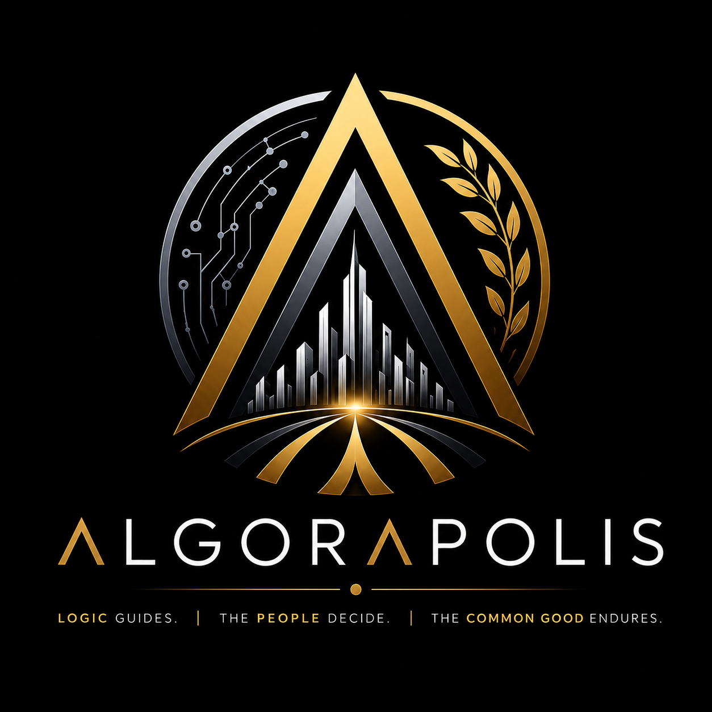

# 🏛️ ALGORAPOLIS

<p align="center">
  
</p>

<p align="center">
  <a href="https://doi.org/10.5281/zenodo.20466164"></a>
  <a href="https://doi.org/10.5281/zenodo.20466389"></a>
  <a href="https://archive.org/details/Algorapolis"></a>
  
  
  
  
</p>


<p align="center">
  <strong>A modular governance architecture that aligns the Rule of Logic (Algo) with the Public Assembly (Agora) to secure the Common Good (Polis).</strong>
</p>

<p align="center">
  <a href="START-HERE.md">🚀 Start Here</a> •
  <a href="DIAGRAMS.md">🗺️ Visual Architecture</a> •
  <a href="#-executive-summary">Executive Summary</a> •
  <a href="#-the-trinity-algo--agora--polis">The Trinity</a> •
  <a href="#-the-civilization-stack-10-layers">Civilization Stack</a> •
  <a href="#-key-principles--guardrails">Key Principles</a> •
  <a href="#-what-algorapolis-is-not">Comparative Governance</a> •
  <a href="#-the-african-origin--tanzania-pilot">African Origin</a> •
  <a href="ROADMAP.md">Roadmap</a> •
  <a href="#-repository-structure">Repository Structure</a> •
  <a href="#-license--attribution">License</a>
</p>

---

## 🌟 Executive Summary

**Algorapolis** is a comprehensive, research-grounded civilization architecture framework designed for governing human societies in the algorithmic age. Conceived and developed by independent Tanzanian researcher **Goodluck Japhet Macha**, it addresses a critical structural failure: that governance systems which work reasonably well in theory produce consistently poor outcomes in practice—both in the Global South and worldwide.

Traditional governance models rely on monolithic ideologies (e.g., pure democracy, technocracy, or meritocracy) and apply them universally to every domain. Algorapolis rejects this uniformity. It introduces the **Modality-Matching Principle**: matching governance tools to the material realities of specific civic domains. 

By utilizing **algorithmic administration** for resource optimization, **democratic deliberation** for value conflicts, **constitutional locks** for human rights protection, and **meritocratic delegation** for expertise-requiring functions, Algorapolis establishes a self-correcting, capture-immune civilizational operating system.

> [!NOTE]
> Algorapolis is not a political party, an ideology, or a commercial software product. It is an open, modular governance blueprint and technical specification designed to scale from local communities to global and interplanetary civilizations.

---

## 🔑 The Trinity: Algo • Agora • Polis

The synthesis of Algorapolis’s three morphemes creates a balanced, stable, and dynamic equilibrium. If any single component is removed, the architecture collapses:

```
                  ┌─────────────────────────────┐
                  │         ALGORAPOLIS         │
                  └──────────────┬──────────────┘
                                 │
         ┌───────────────────────┼───────────────────────┐
         ▼                       ▼                       ▼
┌─────────────────┐     ┌─────────────────┐     ┌─────────────────┐
│      ALGO       │     │      AGORA      │     │      POLIS      │
│  Rule of Logic  │     │Democratic Heart │     │   Common Good   │
└────────┬────────┘     └────────┬────────┘     └────────┬────────┘
         │                       │                       │
         ▼                       ▼                       ▼
- Sovereign Logic Engine - Public Assembly       - Guaranteed Rights
- Law as Code            - Liquid Democracy      - Mutual Obligations
- Impartial Execution    - Real-Time Deliberation- Human Flourishing
```

### 1. Algo — The Rule of Logic (The Administration)
Represented by the **Sovereign Logic Engine (SLE)**. It executes administrative processes with mathematical precision, absolute transparency, and complete incorruptibility. By translating law into formally verified, machine-executable code, the SLE eliminates selective enforcement, bureaucratic capture, and the systemic gap between "law-on-paper" and "law-in-practice."

### 2. Agora — The Democratic Heart (The Interface)
Represented by the **Public Assembly**. It is the human civic participation layer where citizens deliberate, delegate, and set the collective objectives that the SLE executes. It integrates **real-time liquid democracy**, enabling citizens to vote directly or delegate their votes dynamically to trusted domain experts with immediate recall capability.

### 3. Polis — The Common Good (The Guarantees)
Represented by the **Outcome Layer**. It is the promise of fundamental rights, human dignity, capabilities, and flourishing that justifies the entire system. Grounded in both Greek community ideals and the African philosophy of **Ubuntu** (*"I am because we are"*), the Polis ensures that logic and democracy serve human longevity and flourishing, rather than cold mathematical optimization.

---

## 🏛️ The Civilization Stack: 10 Layers

Algorapolis is organized as a full-stack, modular civilization architecture. The stack is split into the mandatory **Core Governance Kernel** and the **Extended Expansion Modules**:

| Layer | Name | Category | Primary Purpose & Features |
| :---: | :--- | :--- | :--- |
| **1** | **Philosophy** | Core Kernel | Foundational logic, civilizational failure analysis (Tainter), Balance Theory (The Grey scale), Meaning Theory (existential sustainability). |
| **2** | **Psychology** | Core Kernel | Human nature engineering, Tribalism Neutralizer (ZKPs), the Empathy Shield, Proof-of-Skill education, Biological Sovereignty. |
| **3** | **Governance** | Core Kernel | Polycentric state architecture, Sovereign Logic Engine (SLE), Law as Code (Lean 4/Coq formal verification), Liquid Democracy. |
| **4** | **Economics** | Core Kernel | Sovereign digital identity, cryptographic privacy, Universal Basic Prebate (UBP), radical meritocracy, Verifiable Value system. |
| **5** | **Technology** | Core Kernel | Smart infrastructure, memory-safe codebases (Rust/Move), distributed consensus, post-quantum cryptography, zero-knowledge proofs. |
| **6** | **Security** | Core Kernel | Anti-capture framework, structural anti-corruption, cryptographically-enforced constitutional locks, emergency dead-man switches. |
| **7** | **Culture** | Extended Module | Civilizational memory, language & communication, civic mythology, creative/artistic civilization, religion & spiritual sovereignty. |
| **8** | **Ecology** | Extended Module | Planetary management, energy civilization metrics, food & agricultural sovereignty, ecological steady-state economics, urban design. |
| **9** | **Civilization** | Extended Module | International relations, time governance, science governance, family/social fabric, disaster & extinction systems, emergence safeguards. |
| **10**| **Ark** | Extended Module | Species survival protocols, Mars & interplanetary governance, adaptive scaling, civilizational pluralism, propagation theory. |

### 🛡️ Adversarial Resilience & Research Extensions
*   **Part XI — Adversarial Resilience Layer**: The "adversarial patches" that secure human sovereignty, specify system limits, manage contested formalization, ensure graceful degradation during infrastructure failure, and define political economy realism.
*   **Part XII — National Digital Twin**: A real-time governance simulation infrastructure for predictive testing of policy impacts before real-world deployment.
*   **Part XIII — Emotional Intelligence & Balance**: Incorporates subjective well-being tracking, the Cultural Preservation Layer (CPL), and the three-chamber **Human Experience Review Board (HERB)** to keep logic and emotion in perfect equilibrium.

---

## 📚 Volume Architecture

To transition from abstract theory to immediate local implementation, the Algorapolis framework is organized into two volumes with distinct horizons:

```
┌─────────────────────────────────────────────────────────────────────────────┐
│                       ALGORAPOLIS CIVILIZATION FRAMEWORK                     │
└──────────────────────────────────────┬──────────────────────────────────────┘
                                       │
         ┌─────────────────────────────┴─────────────────────────────┐
         ▼                                                           ▼
┌────────────────────────────────────────┐ ┌────────────────────────────────────────┐
│      VOLUME I: PRACTICAL ALGORAPOLIS   │ │   VOLUME II: CIVILIZATIONAL ALGORAPOLIS│
├────────────────────────────────────────┤ ├────────────────────────────────────────┤
│ • Focus: Core Governance (Layers 1-6)  │ │ • Focus: Long-Term Horizon (Layers 7-10)│
│ • Horizon: 5 – 30 Years                │ │ • Horizon: 100 – 10,000 Years          │
│ • Practical Goals:                     │ │ • Civilizational Goals:                │
│   - Corruption Elimination             │ │   - Deep-Time Wisdom Preservation      │
│   - Sovereign Digital Identity         │ │   - Interplanetary Propagation (Mars)  │
│   - Digital Twin & Sandboxes           │ │   - Planetary Ecology & Ark Protocols  │
│   - Tanzania Pilot Specification       │ │   - Post-Collapse Recovery Engines     │
└────────────────────────────────────────┘ └────────────────────────────────────────┘
```

> [!TIP]
> *"If Algorapolis cannot survive Mars, it is not robust enough for Earth."* The extreme constraints of Volume II serve to stress-test and harden the governance kernel of Volume I.

---

## 🛡️ Key Principles & Guardrails

1.  **Modality Matching**: No single governance method fits all domains. Deliberation determines values; logic optimizes resources; locks protect human rights; merit selects expertise.
2.  **The SLE Serves; It Does Not Rule**: The Sovereign Logic Engine has no self-set goals. It is a narrow administrative utility, strictly subordinate to human-mandated targets and constitutionally bounded.
3.  **Privacy as a Mathematical Guarantee**: Zero-knowledge proofs (ZKPs), differential privacy (ε ≤ 0.5 for sensitive data), and homomorphic encryption ensure that citizens prove their eligibility without exposing their personal identities.
4.  **Ubuntu-Adapted Emotional Balance**: Pure logic ensures fairness, but emotion ensures humanity. Through the HERB and the Civic Emotional Signals Layer (CESL), Algorapolis actively monitors well-being while enforcing the *No-Scratch* bodily sovereignty principle.
5.  **Self-Limiting Infrastructure**: Designed with Automatic Dissolution Pacts and sunset clauses so that emergency transition authorities cannot entrench themselves or become permanent power structures.

---

## ⚖️ What Algorapolis Is Not

Algorapolis represents a unique synthesis that departs fundamentally from existing paradigms:

| Concept | Primary Model | Why It Fails | How Algorapolis Solves It |
| :--- | :--- | :--- | :--- |
| **Algocracy** | Rule by algorithm. | Monolithic machine rule; humans merely obey. | **Sovereign Logic Engine (SLE)** serves as a utility. It has no goals of its own and is strictly directed by the human Agora. |
| **Technocracy**| Rule by cognitive elite. | Reproduces power concentration, institutional capture, and class exclusion. | The SLE cannot be lobbied, bribed, or socially influenced. Right to participate remains universal and equal. |
| **Cyberocracy**| Governance by info control.| Weaponizes information to exercise power. | Information is structured as a decentralized, open, and auditable public infrastructure. |
| **Epistocracy**| Rule by the knowledgeable. | Apportions voting rights by competence, creating political exclusion. | Participation is universal. Expert influence is exercised voluntarily through liquid delegation, not structural exclusion. |
| **Noocracy** | Rule by wisdom. | Historically metaphysical; lack of concrete error-correction mechanisms. | Operationalizes wisdom through formal verification, adversarial auditing, and concrete constitutional locks. |
| **Network State**| Digitally-first community. | Focuses on migration and territorial acquisition. | A modular governance architecture adoptable by any community, including existing sovereign nation-states. |
| **Smart City** | Digitizing bureaucracy. | Makes centralized surveillance and capture more efficient. | Replaces the operating system with a decentralized, capture-immune, privacy-preserving infrastructure. |
| **Social Credit**| Opaque, punitive surveillance. | Centralized, coercive social control and behavior scoring. | **Decentralized & Restorative**: Built on zero-knowledge proofs and the Verifiable Value system. It rewards value, never punishes dissent. |

---

## 🌍 The African Origin & Tanzania Pilot

Algorapolis was not designed in a Silicon Valley incubator or a Western think-tank. It was forged in **Tanzania** from the direct observation of structural governance failures in East Africa and the Global South. 

Tanzania represents the perfect empirical testbed and pilot environment due to:
*   **130+ Ethnic Groups**: Unified peacefully through Swahili, providing a living model of civilizational pluralism and cultural diversity.
*   **Legal Pluralism**: The successful coexistence of statutory, customary, and Islamic law proves that domain-specific governance modules can operate together.
*   **Fintech Leapfrogging**: Mobile money innovation (M-Pesa) demonstrates that developing nations can directly adopt advanced, leapfrog infrastructures.
*   **Civic Tech Heritage**: Proximity to local innovations like *Ushahidi* shows Africa's capability to lead in crisis-mapping and community-driven technology.

### 📅 The 5-Year Pilot Roadmap (Volume I, Section 46)

```
┌─────────────────────────────────────────────────────────────────────────────┐
│                          5-YEAR TANZANIA PILOT ROADMAP                       │
└──────────────────────────────────────┬──────────────────────────────────────┘
                                       │
      Phase 1 (Years 1-2)             Phase 2 (Years 3-4)            Phase 3 (Year 5)
┌─────────────────────────────┐ ┌─────────────────────────────┐ ┌─────────────────────────────┐
│ • Establish Ubuntu surveys  │ │ • Expand CESL nationally.   │ │ • Integrate Digital Twin &  │
│ • Pilot CESL sentiment      │ │ • Deploy Cultural Preserva- │ │   real-time visualization.  │
│   engines in target districts│ │   tion Layer (CPL).         │ • Full deployment of SLE for │
│ • Constitute HERB Expert    │ │ • Establish HERB Citizen &  │   budgeting & civil dispute │
│   Chamber.                  │ │   Elders Chambers.          │   resolution.               │
└─────────────────────────────┘ └─────────────────────────────┘ └─────────────────────────────┘
```

---

## 🧭 Repository Structure

This repository acts as the central specifications vault for the Algorapolis framework:

```
algorapolis/
├── README.md               # You are here: The Executive Spec
├── START-HERE.md           # ← New visitors start here: plain language entry point
├── DIAGRAMS.md             # Visual architecture: flowcharts, maps, and transition models
├── LICENSE                 # Dual License: MIT (code/specs) + CC-BY-SA 4.0 (content)
├── CONTRIBUTING.md         # Guidelines for developers, researchers, and citizens
├── CODE_OF_CONDUCT.md      # Community expectations and values
├── SECURITY.md             # Vulnerability disclosure and security policy
├── CHANGELOG.md            # Version history and development log
├── ROADMAP.md              # Long-term civilizational & technical milestones
├── .gitignore              # Specifies intentionally untracked files to ignore
│
├── .github/                # Community & Contribution Templates
│   ├── FUNDING.yml         # Project sponsorship configurations
│   ├── PULL_REQUEST_TEMPLATE.md # Standard PR formatting guides
│   └── ISSUE_TEMPLATE/     # Templates for bug reports, feature requests, & proposals
│
├── manifesto/              # The Theoretical Foundation ("Why Algorapolis")
│   ├── 00-PREAMBLE.md      # Conceived out of global and Tanzanian governance failures
│   ├── 01-CORE-PRINCIPLES.md # Foundational philosophies & the Grey scale
│   ├── 02-SOVEREIGN-LOGIC-ENGINE.md # Mechanics of the Sovereign Logic Engine (SLE)
│   ├── 03-EMOTIONAL-INTELLIGENCE.md # Human Experience Review Board & well-being metrics
│   ├── 04-PRIVACY-SOVEREIGNTY.md # Cryptographic privacy safeguards (ZKPs)
│   ├── 05-AFRICAN-CONTEXT.md # Tanzanian origin, Ubuntu integration, and M-Pesa lessons
│   └── 06-FUTURE-DECLARATION.md # Manifesto call to action and species declaration
│
├── framework/              # Technical Architectural Blueprints ("How Algorapolis")
│   ├── ARCHITECTURE.md          # Polycentric modular state specifications
│   ├── DIGITAL-TWIN.md          # National Digital Twin & civilization simulation engines
│   ├── CIVILIZATION-SIMULATION.md # Agent-based modeling & policy simulation engines
│   ├── GOVERNANCE-SANDBOX.md    # Domain-isolated, risk-free policy sandboxes
│   ├── LAYERED-ACCESS.md        # Zero-knowledge credentialing & Proof-of-Skill mechanisms
│   ├── OFFLINE-RESILIENCE.md    # Graceful degradation & Minimum Viable Algorapolis (MVA)
│   ├── REAL-TIME-COORDINATION.md # Dynamic liquid delegation & Public Assembly interfaces
│   ├── ECONOMIC-TELEMETRY.md    # Telemetry systems & Universal Basic Prebate models
│   ├── PREDICTIVE-GOVERNANCE.md # Short-term predictive analytics & planning algorithms
│   ├── INFRASTRUCTURE-AWARENESS.md # Smart grids, transport telemetry & environmental sensing
│   └── EI-ARCHITECTURE.md       # Technical stacks of the EIL (CESL, CPL, HERB)
│
├── schema/                 # Concrete Technical & API Specifications
│   ├── sle-api.yaml        # OpenAPI/Swagger spec for the Sovereign Logic Engine API
│   └── civilization-stack.json # JSON Schema defining civilizational stack layer configurations
│
├── research/               # Empirical Grounding & Evidence
│   ├── BIBLIOGRAPHY.md     # Full structural citations
│   ├── studies/            # Domain-specific deep dives (Studies 01-17)
│   └── case-studies/       # Comparative studies (Bhutan, Estonia, Taiwan, China, etc.)
│
├── docs/                   # Primary Documentation & Civic Guides
│   ├── Algorapolis.docx    # The full, comprehensive 200+ page primary text
│   └── guides/             # Actionable walkthroughs & development manuals
│       ├── README.md       # Guides directory index
│       ├── contributing-a-case-study.md # Technical guidelines for research contributions
│       ├── proposing-a-layer.md        # Standard protocol for proposing system layers
│       └── running-a-sandbox.md        # Operations guide for running sandboxes
│
└── assets/                 # Branding Assets & Media
    ├── README.md           # Brand assets overview & usage instructions
    └── logos/              # Official logotypes, icons, and branding formats
```

---

## 🧬 Theoretical Lineage

Algorapolis is built upon the structural works of Nobel laureates, systems theorists, and civilization researchers:

*   **Joseph Tainter** (*The Collapse of Complex Societies*): Foundational analysis of complexity, marginal returns, and structural collapse.
*   **Elinor Ostrom** (*Governing the Commons*): Polycentric governance and local self-organization principles.
*   **Stafford Beer** (*Brain of the Firm*): The cybernetic Viable System Model (VSM) for balancing local autonomy and systemic control.
*   **Shoshana Zuboff** (*The Age of Surveillance Capitalism*): Core requirements for privacy-first, anti-surveillance architectures.
*   **Viktor Frankl** (*Man's Search for Meaning*): Existential sustainability and logotherapy principles.
*   **Martha Nussbaum & Amartya Sen** (*The Capabilities Approach*): Formulating human flourishing and development metrics as terminal governance goals.
*   **Kahneman & Tversky** (*Heuristics and Biases*): Behavioral economics and cognitive constraint engineering.
*   **Nassim Taleb** (*Antifragile*): Productive instability, stress-responsive design, and risk management.
*   **Toby Ord** (*The Precipice*): Existential risk mitigation and the propagation of civilization.

---


## 📚 How to Cite & Academic Archives

Algorapolis has **two permanent Zenodo records** — one for the written specification (the academic publication) and one for the code/repository snapshot. Use the correct one depending on your context.

---

### 📄 Record 1 — Academic Publication (Cite in research papers)

> **Title:** Algorapolis: A Civilization Architecture Framework  
> **Type:** Publication | **Version:** 1.0.0 | **Date:** May 21, 2026  
> **DOI:** `10.5281/zenodo.20466164` ← *Use this when citing the specification or ideas*

**APA Format:**
> Macha, G. J. (2026). *Algorapolis: A Civilization Architecture Framework* (Version 1.0.0). Zenodo. https://doi.org/10.5281/zenodo.20466164

**BibTeX Format:**
```bibtex
@misc{macha2026algorapolis,
  author       = {Macha, Goodluck Japhet},
  title        = {Algorapolis: A Civilization Architecture Framework},
  month        = may,
  year         = 2026,
  publisher    = {Zenodo},
  version      = {1.0.0},
  doi          = {10.5281/zenodo.20466164},
  url          = {https://doi.org/10.5281/zenodo.20466164}
}
```

---

### 💾 Record 2 — Software Archive (Cite when referencing the code or repository)

> **Title:** GLuckDeity/Algorapolis: v0.1.0 — Genesis  
> **Type:** Software | **Version:** v0.1.0 | **Date:** May 30, 2026  
> **DOI:** `10.5281/zenodo.20466389` ← *Use this when citing the repository, schemas, or API specs*  
> **Concept DOI (all versions):** `10.5281/zenodo.20466388`

**APA Format:**
> Macha, G. J. (2026). *GLuckDeity/Algorapolis: v0.1.0 — Genesis* (v0.1.0). Zenodo. https://doi.org/10.5281/zenodo.20466389

**BibTeX Format:**
```bibtex
@software{macha2026algorapolis_code,
  author       = {Macha, Goodluck Japhet},
  title        = {{GLuckDeity/Algorapolis: v0.1.0 — Genesis}},
  month        = may,
  year         = 2026,
  publisher    = {Zenodo},
  version      = {v0.1.0},
  doi          = {10.5281/zenodo.20466389},
  url          = {https://doi.org/10.5281/zenodo.20466389}
}
```

---

### 🗄️ Immutable Archive Links

| Archive | Type | DOI / Link |
|---------|------|------|
| Zenodo | 📄 Publication — v1.0.0 | [10.5281/zenodo.20466164](https://doi.org/10.5281/zenodo.20466164) |
| Zenodo | 📄 Publication — all versions | [10.5281/zenodo.20466163](https://doi.org/10.5281/zenodo.20466163) |
| Zenodo | 💾 Software Archive — v0.1.0 | [10.5281/zenodo.20466389](https://doi.org/10.5281/zenodo.20466389) |
| Zenodo | 💾 Software Archive — all versions | [10.5281/zenodo.20466388](https://doi.org/10.5281/zenodo.20466388) |
| Internet Archive | 🗄️ Permanent Web Snapshot | [archive.org/details/Algorapolis](https://archive.org/details/Algorapolis) |
| GitHub | 🔧 Live Repository | [GLuckDeity/Algorapolis](https://github.com/GLuckDeity/Algorapolis) |


---

## 📄 License & Attribution

Algorapolis is an active research framework. It is offered to the global community as a foundation, not a conclusion.

*   **Code, Technical Specifications, and Architectures**: Released under the [MIT License](https://opensource.org/licenses/MIT).
*   **Written Content, Research, and Philosophical Texts**: Released under [Creative Commons Attribution-ShareAlike 4.0 International (CC BY-SA 4.0)](https://creativecommons.org/licenses/by-sa/4.0/).

### Author
**Goodluck Japhet Macha**  
*Independent Researcher*  
Tanzania, May 2026

---

<p align="center">
  <em>"Math is the Armor. Privacy is the Right. Merit is the Ladder. Balance is the Law. Survival is the Goal. Algorapolis is the Ark."</em>
</p>